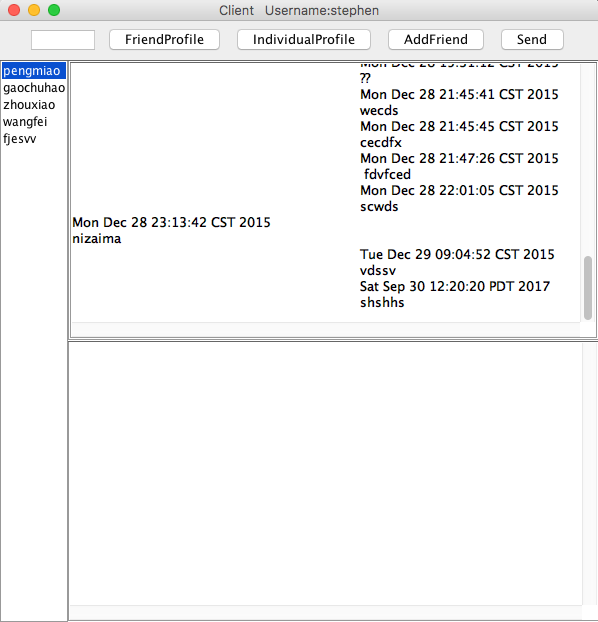

# InstantMessage

* Chat App coded by Java
* Used Java swing, threads and socket packages to implement instant messaging
* Implemented accounts registration, contact management, instant messaging, and leveraged Java and MySQL drivers to store user data and message data in MySQL databases

## program structure

## login interface

## chat interface

